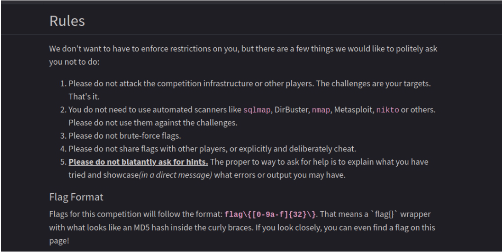
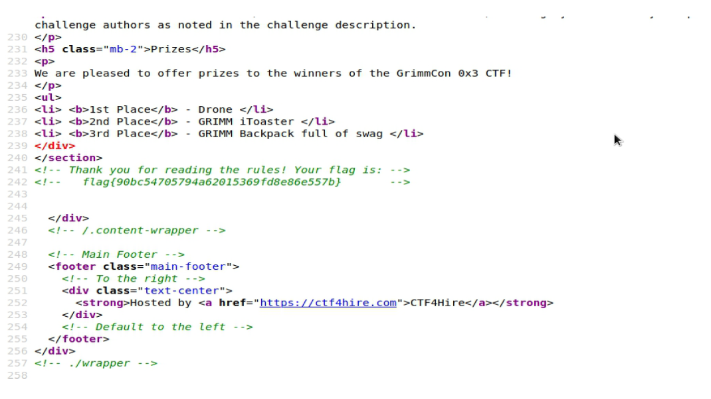
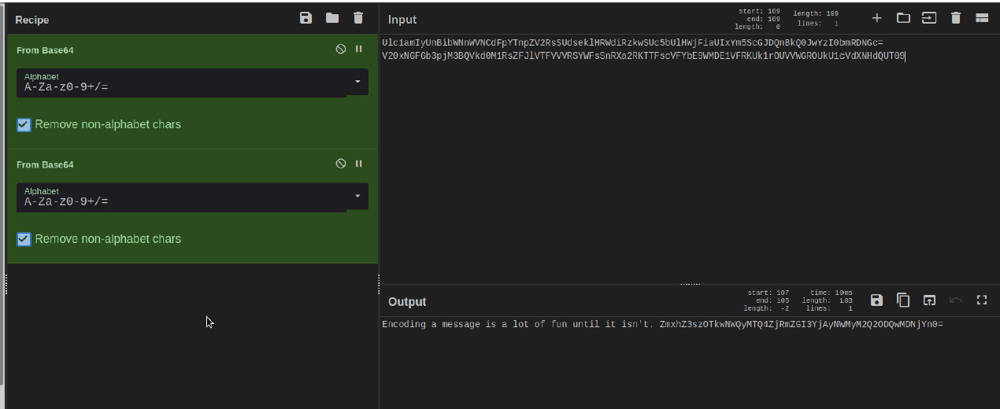
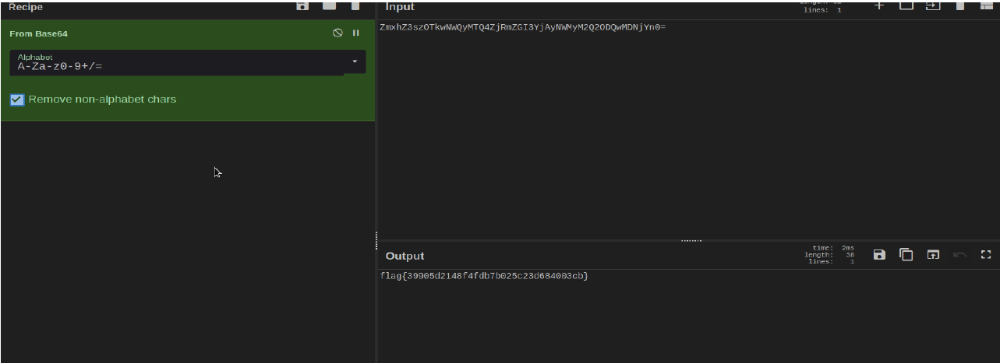
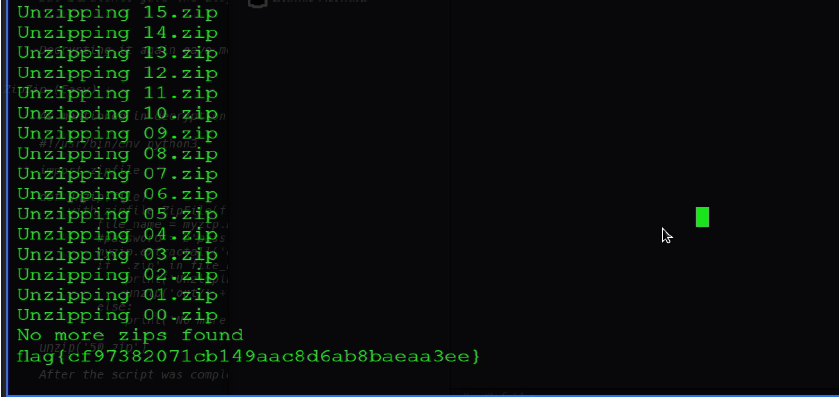
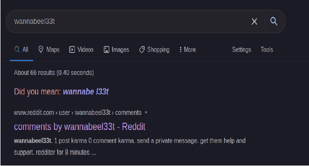
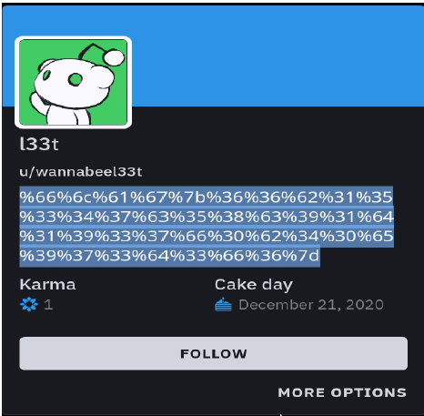
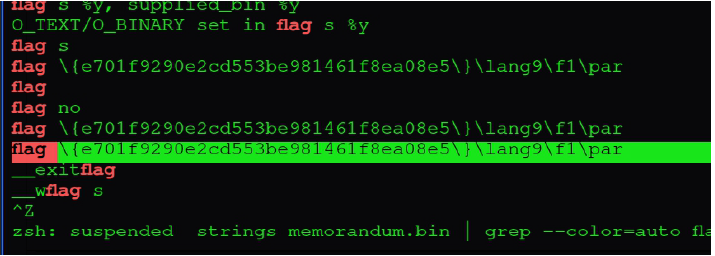

<p align="center"></p>

<h1> <p align="center">  GrimmCon CTF - Writeup (2020)  </p></h1>

It was My very first CTF competition ever and a Great Experience, I was so happy to even solve a few of them without Help/Hints.

### 1. Read The Rules (Warm Up) :

When opened the _Read the Rules_ page it seemed to be an ordinary web page, Nothing
Special!!

<p align="center"> </p>


I decided to look the source code of the page and there it was, A Comment which had
the valid flag _flag{90bc54705794a62015369fd8e86e557b}_.

<p align="center"> </p>


### 2. Triple (Easy) :

First look at the code "Ulc1amIyUnBibWNnWVNCdFp …." suggested that it is base64 encoded.
I jumped to [CyberChef](https://gchq.github.io/CyberChef/) (_SwissKnife for Ecryption/Decryption_)  and decoded it with base64 recipe.
But it didn't gave the flag.Then I recalled the name 'TRIPLE' which gave me idea to decrypt it 2 more time. Second Decryption gave a sweet message.

<p align="center"> </p>

Decrypting it again gave me a vaild flag _flag{39905d2148f4fdb7b025c23d684003cb}_.

<p align="center"> </p>


### 3. ZipZip (Easy) :

As mentioned in description file was password encoded multi-ziped folder which had
flag in it some where.So Following the description I beagn unziping file but it was
taking lot of time so I google script to do it quickly and found this python code

```python

#!/usr/bin/env python3

import zipfile

def unzip(file):

	with zipfile.ZipFile(file) as myzip:
	file_name = myzip.namelist()[0]
	#password = b'pass'
	myzip.extractall('out', pwd= b'pass')
	if '.zip' in file_name :
		print('Unzipping', file_name)
		unzip('out/' + file_name)
	else:
	print('No more zips found')

unzip('50.zip')

```
cd to the folder which had zip file and run the script using the command 
```bash
$python3 zipzip.py && ./out/flag.txt 
``` 
After the script was complete there was a file named flag.txt
which had the vaild flag _flag{cf97382071cb149aac8d6ab8baeaa3ee}_.

<p align="center"> </p>

### 4. Wannabeel33t (OSINT):

As the type of task suggest OSINT or Information Gathering.I started googling the name and
found the first link a to reddit account. The Description of the account had some sort of
encrypted msg.

<p align="center"> </p><p align="center"> </p>

I jumped to [CyberChef](https://gchq.github.io/CyberChef/) ( _SwissKnife for Ecryption/Decryption_ ) and decoded it with Magic recipe. And it was
decoded by URL_decoder and gave the _flag{66b15347c58c91d1937f0b40e973d3f6}_.


### 5. Memorandum (Forensics):

Download the zip file and extract the files. It is found that it contains only single binary
file. Lets dive in and search for the required flag pattern in the binary.

Use the string search command to get output and search for flag. Finally, found the valid flag _flag{e701f9290e2cd553be981461f8ea08e5}_.
```bash 
strings memorandum.bin | grep flag
``` 
<p align="center"> </p>
