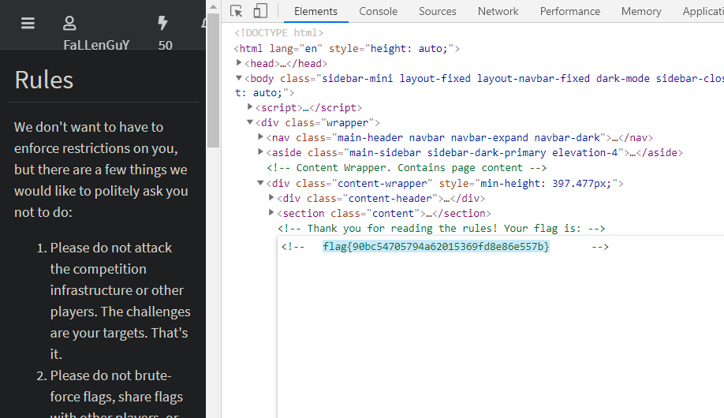

<p align="center"></p>

<h1> <p align="center"> NahamCon CTF - Writeup (2021) </p></h1>

Finally, after a month of hype I had a chance to play and here are writeups for some of the challenges I solved.

### Read The Rules (Warm Up) :

When opened the _Read the Rules_ page it seemed to be an ordinary web page, Nothing
Special!! 

I decided to look the source code of the page and there it was, A Comment which had
the valid flag _flag{90bc54705794a62015369fd8e86e557b}_.

<p align="center"> </p>


### Shoelaces :

<p align="center"> </p>

Shoelace.jpg look liked a simple image at first I thought it was a stego image, 
but later realised its normal image with flag is encoded in it. So output the printable strings and grep the flag.  
_flag{137288e960a3ae9b148e8a7db16a69b0}_. 

```bash 
$ strings shoelaces.jpg | grep -i flag
flag{137288e960a3ae9b148e8a7db16a69b0}
```

### Pollex : 

So I downloaded the file give when I visited the downloaded folder I saw a flag at the bottom of image now when opened iw was gone.
I decided to screen shot the flag and clear it.  _flag{65c34a1ec121a286600ddd48fe36bc00}_
 
<p align="center"> </p>

### Veebee :

So it was a .vbe file and thanks to John Hammond, the author, he had the tool to solve this in his [github repo](https://github.com/JohnHammond/vbe-decoder).
```bash
$ python3 vbedecode.py veebee.vbe                                
                            
' VeeBee goes buzz buzz
'
'
MsgBox("Sorry, not that easy!")
MsgBox("Okay, actually, you're right. It is that easy.")
MsgBox("flag{f805593d933f5433f2a04f082f400d8c}")
```

### The Mission :

This was straight forward challenge, same as Read the Rules.

<p align="center"> </p>

This challenge revealed a mission category of challenges where to get to next challenge you have to solve the previous challenge.

#### Bionic:

This challenge gave a static website [Constellations](https://constellations.page/) to explore and find flags.

<p align="center"> </p>

So like any web challenge I started with looking for robots.txt and there it was url for next challenge and a flag.

<p align="center"> </p>


### HTB Modules
	
	- Linux Fundamentals : This is more like a linux Fundamentals cource Provided as challenge by the HTB. Good for someone trying to brush up thier linux knowledge.
	
	- Introduction to Web Applications : This is a web Fundamental cource Provided as challenge by the HTB. Good for someone trying to brush up thier  knowledge on Web Applications.
	
	- Attacking Web Applications with Ffuf : This is an easy offencive cource Provided as challenge by the HTB. Good for someone trying to learn about fuzzing and tools.
 
