# [Chocolate Factory ](https://tryhackme.com/room/chocolatefactory)
----------------------------------------------
<p align="center"> </p>
So lets Dive in…

Began with a nmap scan..
```bash 
$ sudo nmap -T4 -sV -sC target.txt
```
And with that we get some interesting results.

<p align="center"> 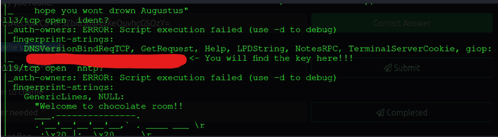</p>

Just click the link and it seems its downloadable.

Now open and it seems to be a different encoding probably Hex. Lets try
reading the file as strings 
```bash 
$ strings downloaded_file.txt 
```

<p align="center">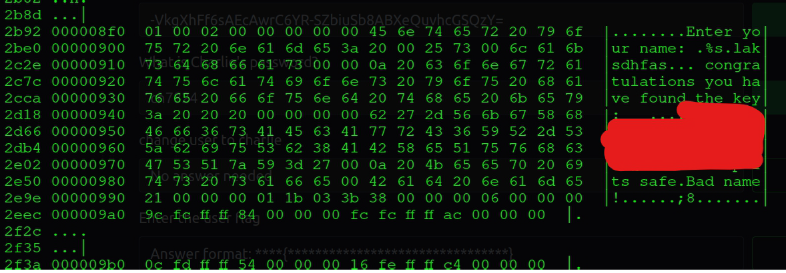</p>

There’s also a FTP port open lets access it and get the file on it.
```bash 
$  ftp target.txt 
``` 

<p align="center">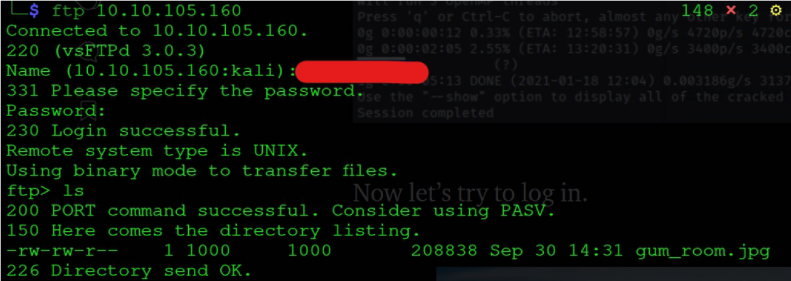</p>

It seems it is Stego image. Lets check if it has file encoded in it…
```bash 
$ sudo steghide -info gum_room.jpg 
``` 
It had some file in it.So lets extract it.
```bash 
$ steghide --extract -sf gum_room.jpg 
```

<p align="center">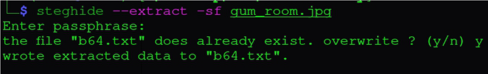</p>

Extracted file seems to be some kind of encryption so lets jump to
[Cyberchef]( https://gchq.github.io/CyberChef/ ), upload & decrypt it and save output to a file hash.txt

<p align="center">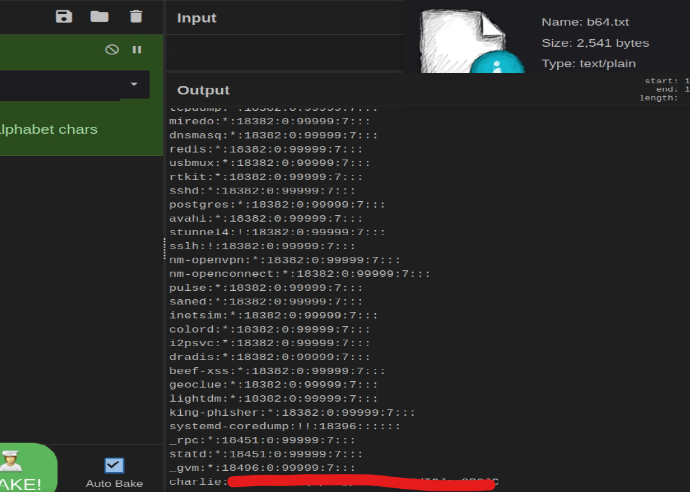</p>

It looks like user and password hashes, So lets crack hash…
```bash 
$ sudo john --wordlist=/usr/share/wordlist/rockyou.txt hash.txt 
```

<p align="center">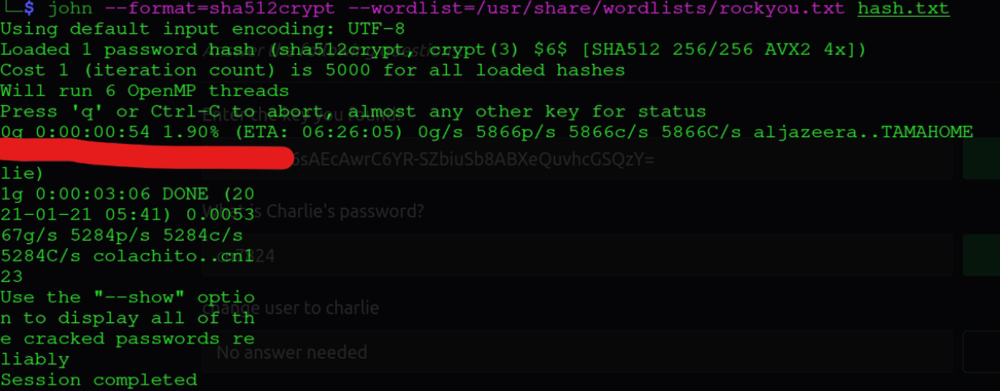</p>

Now that’s done lets login to webpage using cracked password…
This give us with a dashboard that run commands.

<p align="center">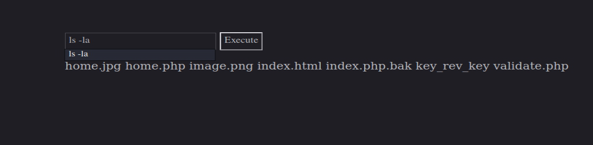</p>

Now lets get a reverse shell on the target. And then stabilize shell.

<p align="center">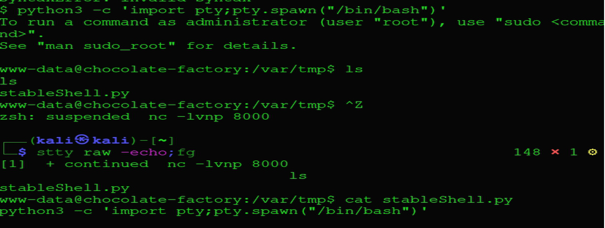</p>

### Now lets try to get charlie user...

After lurking around I found some interesting files.SSH to charlie with the private RSA key and get user flag.

<p align="center">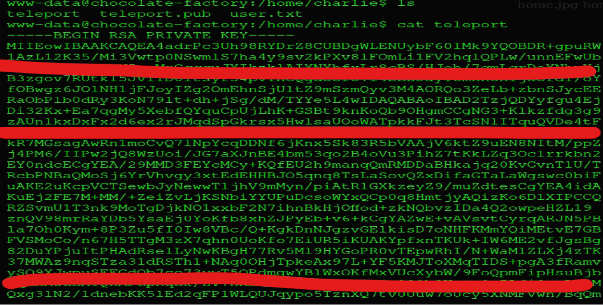</p>


### Now lets get root user...
After some linux enumeration using [linEnum](https://github.com/rebootuser/LinEnum) or [linPEAS](https://github.com/carlospolop/privilege-escalation-awesome-scripts-suite/tree/master/linPEAS) it was found there is a sudo pwnage with vim. 

<p align="center">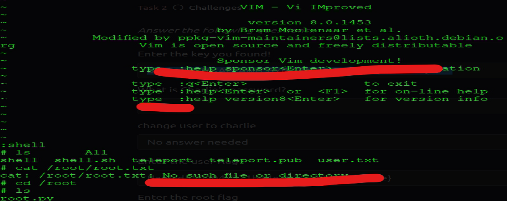</p>

Root flag is a python file and seems require a key as input.
After some hit and trial I decided to use the key found before from web as
input and Woaah!! There it was.

<p align="center">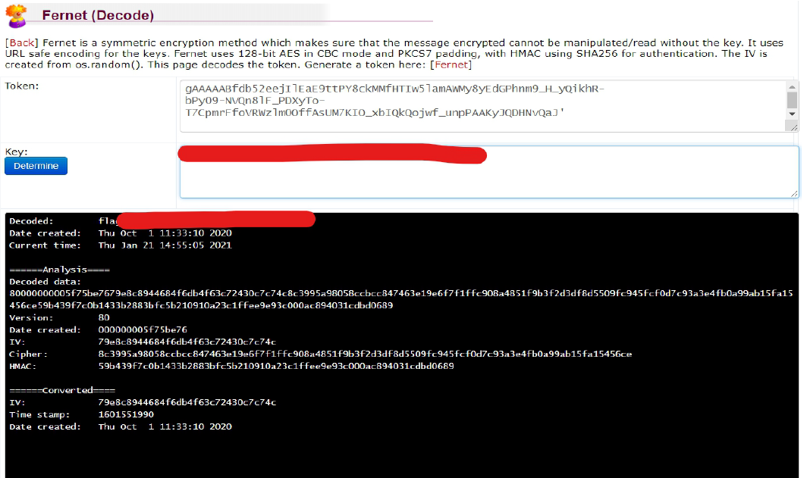</p>

#### PS: I was unable to make that python script to run successful, I got an alternative way to decode it [Fernet Decoder](https://asecuritysite.com/encryption/ferdecode).

And with that **Chocolate Factory is Rooted.**
